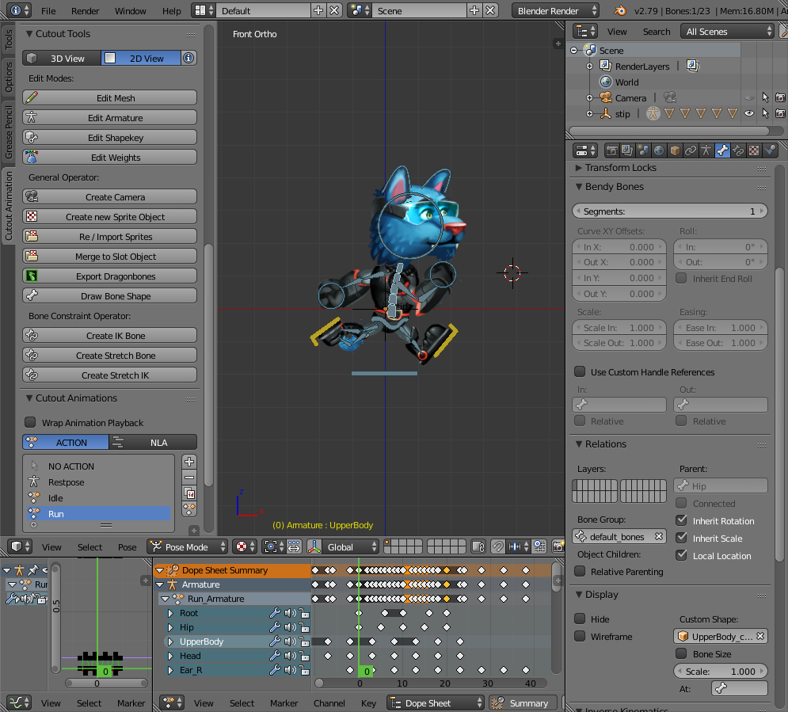
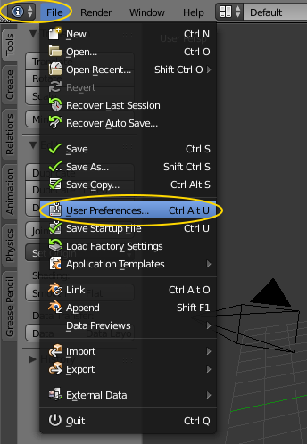
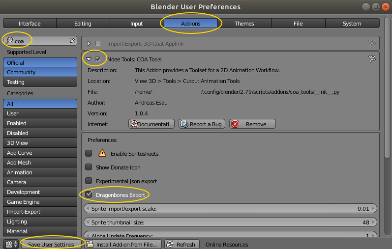
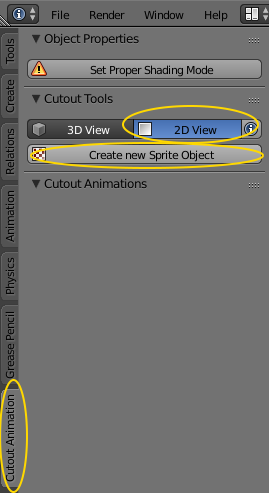
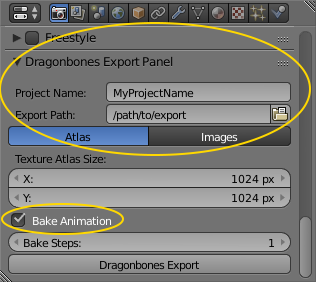

# Cutout Animation Tools - Documentation
This is the Documentation for the Blender/Godot Addon Cutout Animation Tools.

If you like this addon and want to thank me with a small donation feel free to do this here:

## Description
The Cutout Animation Tools (COA Tools) Addon for blender is a 2D rigging and animation suite. It offers you similar tools as for example programs like Spine or Spriter. COA Tools offer you a rapid workflow to create 2D Cutout Character/Animations in blender. Thanks to blenders great animation system and and this addon you get a powerfull solution to create 2D animations. It is parted into 3 different components. Photoshop sprite exporter, Blender Addon, Godot importer.

[Take a look at the addon in action.](https://www.youtube.com/playlist?list=PLPI26-KXCXpA-VMlDIWpmdq6M1m4LEjf_)

### Photoshop sprite exporter
Quickly export photoshop layers into separate files with json coordinate informations. This can be used in blender to import sprites very quickly.
Features:
- export layers as sprites
- export folder with multiple layers as spritesheets
- generate json data with all layer positions and spritesheet informations

### GIMP sprite exporter
Export GIMP layers and layer groups into separate files with json coordinate information. For additional usage information see the README.md in the GIMP folder.

### Cutout Animation Tools Blender
This is the biggest component, as most of the work will be done here.
Features the addon offers are:
- sprite importer (import single sprites or multiple, or use json data as import information)
- animated spritesheet support for meshes
- armature editing - superfast bone creation tool. Just draw bones and click append sprites to bones
- mesh editing - draw vertex countours and fill them quickly with tesselated mesh. filling also unwraps and maps texture data
- weight editing - fast weight editing for tesselated meshes
- fast ik and stretch to constraint generation 
- enhanced animation handling for sprite_objects
- Spriteobject outliner -> displays all containing sprites, armatures with bones for better and quick access to single sprites
- ortho cam operator -> generates an orthogonal camera which can be used to render animations. Camera resolution fits perfectly the pixel space of sprites
- json export - > Exports all sprite_object data to a json file. Supported features are: Bone and Sprite hierarchy export. Baked animation export

### Godot Cutout Animation Importer
This is an advanced importer that helps you get all your exported blender data into godot.
Features:
- Json importer
- sprites, bones and animations get imported
- clever reimport functionality. Offers the possibility to merge local changes that were made in godot to the newly imported scene. This enables a very flexible workflow. Work in blender, then export. Import in godot. Make additions like adding new nodes, adding custom animations. After reimport all local changes will be preserved if merging is enabled.

## Download and Installation
Download or Clone the github repository to your local drive. If you download the ZIP File from Github, please make sure to unzip.
Don't try to install the downloaded zip file directly in blender. This won't work. Once unzipped follow the installation instructions below.

### Photoshop Exporter:

The .jsx file has to be copied into the photoshop scripts folder which is located in:

C:\Program Files\Adobe\Adobe Photoshop CC 2015\Presets\Scripts

Don’t forget to restart Photoshop and then go to File -> Scripts -> BlenderExporter.jsx

### GIMP Exporter:

The coatools_exporter.py should be copied to your GIMP plug-ins folder which is located in:
- Linux: /home/YOU/.gimp2.8/plug-ins/
- Windows: C:\Users\YOU\.gimp2.8\plug-ins

It should show up unde Files>Export to CoaTools... after your restart GIMP

### Blender Addon:

The add-on is in this repository (`Blender/coa_tools`), so download it:

- [Download this repository](https://github.com/ndee85/coa_tools/releases/latest) and extract it
- Zip the subfolder `coa_tools/Blender/coa_tools` so that you have a `coa_tools.zip` file.

Import and enable the add-on in Blender:

- In Blender, go to File -> User Preferences, and open the "Add-ons" tab

- Click "Install Add-on from file..." at the bottom of the User Preferences window
- Load your zipped file `coa_tools.zip`
- Search for "coa" to find the COA Tools add-on, then enable it, and don't forget to enable "DragonBones export" if you need to
- Click "Save user settings" to make sure the addon is still enabled ater Blender restart.

You're good to go !

- You should now see the "Cutout Animation" side-tab, open it
- Create your first Sprite object, and you can now start to build your armature.

[Take a look at the addon in action.](https://www.youtube.com/playlist?list=PLPI26-KXCXpA-VMlDIWpmdq6M1m4LEjf_)

**Note** To use DragonBones export feature:

You have to configure export name and export path or you'll get the error `Export Path does not exists. Set a valid Export Path.`

- In the "Properties" view, "Render" tab, scroll to the very bottom to the "Dragonbones Export Panel"
- Fill in the "Project name" and set an "Export path"
- Check the "Bake animation" checkbox to have an accurate animation (it is needed if you use DragonBones JS runtime)

### Godot Importer:
Notice, this importer will only run with current godot 2.1 dev builds. 
Create an /addons folder in your game projects folder and copy the coa_importer folder into that addons folder. Once the files are loaded go to Project Settings -> Plugins -> Cutout Animation Importer and activate the Plugin.

